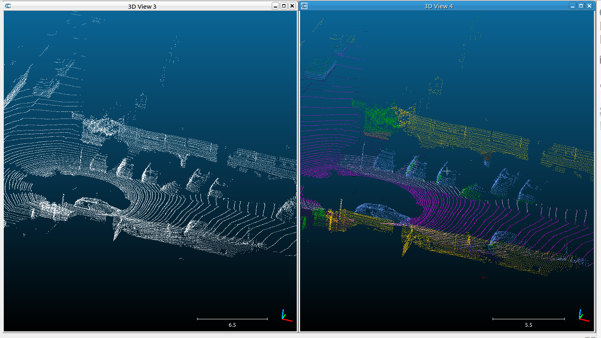
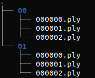
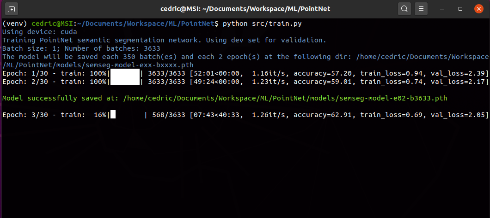
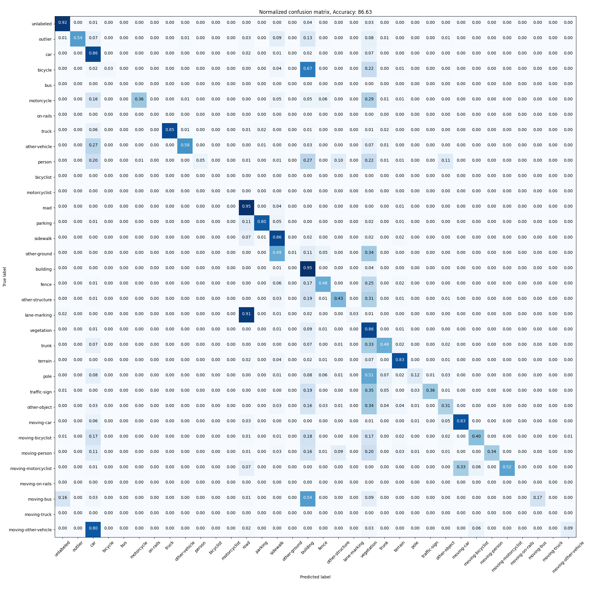
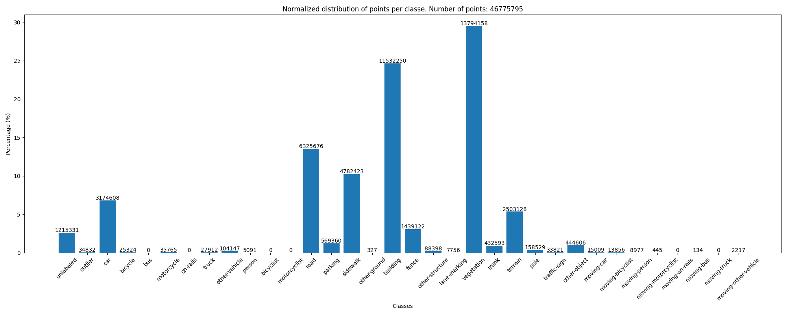

# PointNet PyTorch
Own implementation of the [PointNet](https://arxiv.org/abs/1612.00593) __semantic segmentation__ neurral network, trained on the [semantic-kitti](http://www.semantic-kitti.org/) dataset.


## Installation on Ubuntu 20.04

##### Install virtualenv
```
sudo apt-get update
sudo apt-get install build-essential libssl-dev libffi-dev python-dev
sudo apt install python3-pip
sudo pip3 install virtualenv 
```
##### Install Requirements
```
virtualenv -p python3 venv
source venv/bin/activate
which python  # Check which python you use
python --version  # Check python version
pip install -r requirements.txt
```

## Usage


### Prediction

##### Model
A pre-trained model is available [here](https://github.com/KASCedric/PointNetDemo). Use the following command lines to download it.
```
mkdir -p models
wget https://github.com/KASCedric/PointNetDemo/blob/main/sample-model.pth?raw=true -O models/sample-model.pth
```
##### Data
- You can directly download a [downsampled point cloud](https://github.com/KASCedric/PointNetDemo) for the inference:
    ```
    mkdir -p data
    wget https://github.com/KASCedric/PointNetDemo/blob/main/ds-data.ply?raw=true -O data/ds-data.ply
    ```
- Or download a [raw data](https://github.com/KASCedric/PointNetDemo) and downsample it so that is has the same distribution as the pointclouds used to train the model:
    ```
    mkdir -p data
    wget https://github.com/KASCedric/PointNetDemo/blob/main/raw-data.bin?raw=true -O data/raw-data.bin
    cxx/preprocess/build/downsample --input_file=data/raw-data.bin --output_file=data/ds-data.ply
    ```
    Note: Please read the [documentation](https://github.com/KASCedric/PointNet/tree/main/cxx/preprocess) to build the cxx `downsample` executable 

##### Inference 

Use the following command to predict the labels:
```
python src/inference.py --model="models/sample-model.pth" --input_file="data/ds-data.ply" --output_file="processed/ds-data.ply"
```
A pointcloud before and after prediction:



### Train
```
python src/train.py --n_epoch=30 --validate=True --models_folder=path/to/models --data_folder=path/to/data --sequence=0
```
Where `path/to/models` is the folder where the trained models are saved.
`path/to/data` contains the training dataset. Folder `path/to/data/00` correspond to sequence 0, etc.


Data folder architecture:






### Evaluate

```
python src/evaluate.py --model=path/to/model --data_folder=path/to/data --sequence=0
```
The command above will evaluate the model on the test set, and will print the accuracy of the model. 
The confusion matrix and the classes distribution of the dataset are saved in the `eval` subdirectory located at the parent 
directory of the model

Confusion matrix:


Test set classes distribution:

