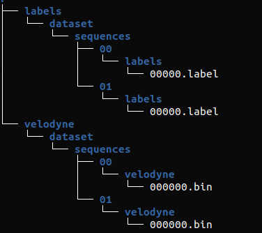
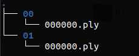

# C++ code for [semantic-kitti](http://www.semantic-kitti.org/) dataset preprocessing

## Run on Ubuntu 20.04

### Dependencies
```
sudo apt install cmake
sudo apt install libpcl-dev
sudo apt-get install libomp-dev
```

### Build
```
mkdir build
cd build
cmake ..
make
```
### Usage
```
./preprocess --help
```
```
./preprocess --sequence=<sequence> --raw_folder=path/to/raw --processed_folder=path/to/processed --semantic_kitti=path/to/semantic/kitti
```
Where `<sequence>` is the sequence of the kitti velodyne dataset (0 to 10). 
`path/to/processed` is an empty folder where the processed data will be saved.
`path/to/semantic/kitti` is the path to the `root_dir/src/semantic-kitti.json` file used to store the semantic-kitti dataset configuration.
`path/to/raw` is the folder that contains the raw [semantic-kitti](http://www.semantic-kitti.org/) dataset.



Raw folder architecture




Processed folder architecture

The processed .ply files contain `(x, y, z, label)` data.